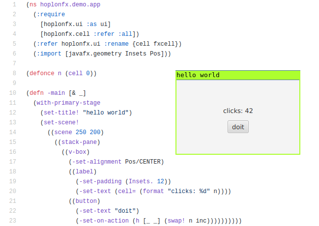

# hoplonfx

<p align="center">
  
  <br>
</p>

First get a REPL going:

```
$ boot javac repl
```

Then eval the `hoplonfx.demo.app` namespace:

```clojure
=> (use 'hoplonfx.demo.app)
=> (-main)
```
